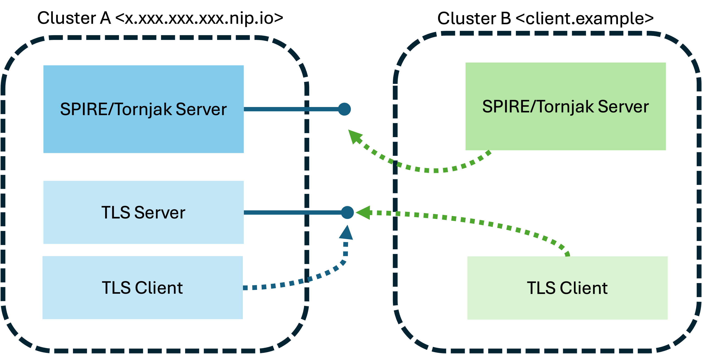

# Federate two SPIRE-enabled Kind clusters

In this tutorial, we will be creating two kind clusters, deploying SPIRE on them, deploy simple applications, and federating the clusters through Tornjak. 

The following structure is the end goal:



We will build this with the following steps:

1. Setup the clusters
   1. Create the Kind Clusters
   2. Deploy SPIRE on both clusters
   3. Enable the experimental feature on Tornjak
   4. Expose the relevant endpoints
2. Deploy the workloads
   1. Deploy the server workload on Cluster A
   2. Deploy the client workload on Cluster A
   3. Deploy the client workload on Cluster B
3. Federate SPIRE Server B with SPIRE Server A
   1. Federate using the Tornjak API
   2. Configure workloads in Cluster B to `federateWith` Cluster A
4. Test workload connection
5. Cleanup

### Required Steps for Federation

Federation is the process of establishing trust between SPIRE servers. In this case we will be establishing a federation relationship on Cluster B with Cluster A. This requires that Cluster A has an exposed bundle endpoint. 

If this is true, we can establish the relationship in two steps:
1. Obtain the initial trust bundle of Cluster A
2. Call the Tornjak API endpoint to establish a federation relationship with the following information:
  - Bundle Endpoint URL
  - Trust Domain
  - Initial bundle

Once this is done, federation is established. 

#### Note on how foreign trust bundles get to workloads

Workloads obtain trust bundles through the workload API, even for foreign trust bundles. However, it is required that for each workload that needs a foreign trust bundle that the workload's entry is configured to `federateWith` the foreign trust domain. 

----------

## Step 0: Requirements

This tutorial has been tested on Kind with rootful Podman on OSX. Any container runtime that Kind supports should work as well. 

The following tools are required for the commands we use: 

- kubectl 
- Helm
- kind
- podman
- git
- envsubst
- jq
- ip

## Step 1: Setup the Clusters

We will create the clusters and deploy SPIRE on both. Cluster A will use a nips address. Cluster B will use localhost and port-forwarding.

Let's obtain the necessary deployment files for this tutorial:

```
git clone https://github.com/maia-iyer/spire-demos.git
cd spire-demos/tornjak_crd_federation
```

### Step 1.1: Create the Kind Clusters

If a Podman machine is up and running skip the following step. Else on OSX or Windows, run this command to start the podman machine:

```
podman machine init -m 4096 --rootful=true
podman machine start
```

If you have multiple container runtimes, specify the proper runtime:

```
export KIND_EXPERIMENTAL_PROVIDER=podman
```

Now we can create the Kind clusters. We will add extra port mappings to cluster A because we will set up ingress on that cluster. 

```
kind create cluster --name=cluster-a --config=resources/kind_cluster_a_config.yaml
kind create cluster --name=cluster-b
```

### Step 1.2: Set up Ingress on Cluster A

On Kind we can deploy an Nginx Ingress controller to access application services running within the environment.

Set the `APP_DOMAIN` environment variable to containe the subdomain for which all applications can be accessed. On RHEL: 

```
export APP_DOMAIN=$(ip -4 addr show ens192 | ggrep -oP '(?<=inet\s)\d+(\.\d+){3}').nip.io
```

On MacOS/Windows:

```
export APP_DOMAIN=$(ipconfig getifaddr en0).nip.io
```

Confirm the variable has been populated:

```
echo $APP_DOMAIN
```

A value similar to `x.xxx.xxx.xxx.nip.io` indicates the variable has been set properly.

We will also use a local self-signed certificate to secure the TLS connections of these applications and deploy the ingress controller:

```
kubectl apply -f resources/kind_ingress_deployment_a.yaml --context=kind-cluster-a
kubectl wait --namespace ingress-nginx --context=kind-cluster-a \
  --for=condition=ready pod \
  --selector=app.kubernetes.io/component=controller \
  --timeout=90s
```

### Step 1.3: Deploy SPIRE on each Kind cluster

Now we can deploy SPIRE on each Kind cluster. The following deploys on Cluster A

```
helm upgrade --install -n spire-mgmt spire-crds spire-crds --repo https://spiffe.github.io/helm-charts-hardened/ --create-namespace --kube-context=kind-cluster-a
envsubst < resources/helm_values_a.yaml | helm upgrade --install -n spire-mgmt spire spire --repo https://spiffe.github.io/helm-charts-hardened/ -f - --kube-context=kind-cluster-a
```

And the same for Cluster B

```
helm upgrade --install -n spire-mgmt spire-crds spire-crds --repo https://spiffe.github.io/helm-charts-hardened/ --create-namespace --kube-context=kind-cluster-b
envsubst < resources/helm_values_b.yaml | helm upgrade --install -n spire-mgmt spire spire --repo https://spiffe.github.io/helm-charts-hardened/ -f - --kube-context=kind-cluster-b
```

#### Note: on the Helm installs

Notably, the helm installs are nearly identical, except for two things:

1. They have different trust domain names. It is not possible to federated two SPIRE servers with the same trust domain names. 
2. Only Cluster A has federation enabled. This is because in this demo we only need to federate in one direction.

### Step 1.4: Configure Tornjak

Run the following to configure Tornjak to enable CRD management:

```
kubectl apply -f resources/tornjak_cm.yaml --context=kind-cluster-a
kubectl delete po -n spire-server spire-server-0 --context=kind-cluster-a
kubectl apply -f resources/tornjak_cm.yaml --context=kind-cluster-b
kubectl delete po -n spire-server spire-server-0 --context=kind-cluster-b
```

### Step 1.5: Port-forward from Cluster B

Open a new terminal and run the resulting line and the port-forward: 

```
kubectl port-forward -n spire-server --context=kind-cluster-b svc/spire-tornjak-backend 10000:10000
```

## Step 2: Deploy the workloads

In this tutorial, we will deploy a TLS server on the Cluster A, and a TLS client on both clusters. 

For reference, the TLS server is SPIFFE-enabled and uses the go-spiffe library to communicate with the SPIRE agent's workload API. 

The TLS client is an Alpine image that uses the SPIFFE Helper to locally populate files with SPIRE-issued certificates. We will manually exec and curl into the container to demonstrate TLS connection. 

#### Note: on TLS connections

We are using one-direction TLS connection where clients verify the authenticity of the server. Therefore, proper communication requires the server presents a certificate that matches clients' trust bundles. Therefore, for this tutorial, we only need allow the trust bundle from Cluster A to be given to the workload in Cluster B, and no trust bundle from Cluster B need be given to workloads in Cluster A in this simple setup. 

### Step 2.0: [OPTIONAL] Build your own images

Images for the server and clident are publicly available at `docker.io/maiariyer/tls-server:v1` and `docker.io/maiariyer/tls-client:v1` respectively. This tutorial will use these public images. 

If you would like to modify the applications and build the images yourself, or if you come across image pulling errors with DockerHub, the source files for the TLS server and client are in the `resources/server` and `resources/client` directories respectively. You can optionally build and load the images into kind using the following: 

```
podman build -t docker.io/maiariyer/tls-server:v1 server --load
kind load docker-image docker.io/maiariyer/tls-server:v1
podman build -t docker.io/maiariyer/tls-client:v1 client --load
kind load docker-image docker.io/maiariyer/tls-client:v1
```

### Step 2.1: Deploy the server

Let's deploy the SPIFFE-enabled TLS server on Cluster A:

```
envsubst < resources/workload_server.yaml | kubectl apply --context=kind-cluster-a -f -
kubectl wait -n demo --context=kind-cluster-a --for=condition=ready pod --selector=app=demo-server --timeout=180s
```

### Step 2.2: Deploy the client in Cluster A

Let's deploy the client into cluster A:

```
kubectl apply -f resources/workload_client.yaml --context=kind-cluster-a
kubectl wait -n demo --context=kind-cluster-a --for=condition=ready pod --selector=app=client --timeout=180s
```

Once it's running, let's exec into the pod and curl the TLS server:

```
kubectl exec -n demo -it $(kubectl get po -n demo -o name -l app=client --context=kind-cluster-a) --context=kind-cluster-a -- curl --cacert /opt/svid_bundle.pem https://demo-server.$APP_DOMAIN
```

You should get a `Success!!!` message in response. 

### Step 2.3: Deploy the client into Cluster B

Let's deploy the client into cluster B:

```
kubectl apply -f resources/workload_client.yaml --context=kind-cluster-b
kubectl wait -n demo --context=kind-cluster-b --for=condition=ready pod --selector=app=client --timeout=180s
```

Once it's running, let's exec into the pod and curl the TLS server:

```
kubectl exec -n demo -it $(kubectl get po -n demo -o name -l app=client --context=kind-cluster-b) --context=kind-cluster-b -- curl --cacert /opt/svid_bundle.pem https://demo-server.$APP_DOMAIN
```

You should get an error message in response:

```
curl: (60) SSL certificate problem: unable to get local issuer certificate
More details here: https://curl.se/docs/sslcerts.html

curl failed to verify the legitimacy of the server and therefore could not
establish a secure connection to it. To learn more about this situation and
how to fix it, please visit the webpage mentioned above.
command terminated with exit code 60
```

### Step 2.4: Inspect the trust bundles

We are deploying identical clients which use the spiffe-helper to populate the local file `/opt/svid_bundle.pem` with the trust bundles provided via the SPIFFE workload API. We can exec into each container to view the certificates. Depending on how long the clusters are running for and the time interval used for rotation, `/opt/svid_bundle.pem` may have more than one certificate at this point. Use the following to store the chain of trusted certificates in a temporary local file and view the subject information for the client in trust domain A:

```
kubectl exec -n demo -it $(kubectl get po -n demo -o name -l app=client --context=kind-cluster-a) --context=kind-cluster-a -- cat /opt/svid_bundle.pem > bundle_a.pem
openssl crl2pkcs7 -nocrl -certfile bundle_a.pem | openssl pkcs7 -print_certs -noout | grep "subject="
```

And the client in trust domain B: 

```
kubectl exec -n demo -it $(kubectl get po -n demo -o name -l app=client --context=kind-cluster-b) --context=kind-cluster-b -- cat /opt/svid_bundle.pem > bundle_b.pem
openssl crl2pkcs7 -nocrl -certfile bundle_b.pem | openssl pkcs7 -print_certs -noout | grep "subject="
```

You should see that every line for the trust bundle in the client in cluster A should have Common Name `xxx.xxx.x.xx.nip.io` and that every line for the client in cluster B should have Common Name `client.example`


## Step 3: Federate the clusters

As we saw, workloads from the same trust domain have the proper trust bundle to properly establish TLS connection with the TLS server. However, workloads from a separate trust domain do not have the proper trust bundle. We will now federate SPIRE Server B with SPIRE server a using the Tornjak API. 

### Step 3.1: Federate the SPIRE Servers

We can do this with two calls: 

1. Obtain the trust bundle from Trust Domain A
2. Create a federation relationship using that bundle on SPIRE Server B. 

The first step can be done via curl command. We will use the Tornjak API for this: 

```
curl -sk https://tornjak-backend.$APP_DOMAIN/api/v1/spire/bundle | jq
```

The response should look something like this: 

```
{
  "trust_domain": "x.xx.xxx.xxx.nip.io",
  "x509_authorities": [
    {
      "asn1": "MIID+TC...J8LQ=="
    }
  ],
  "jwt_authorities": [
    {
      "public_key": "MIIBIjAN...",
      "key_id": "...",
      "expires_at": 1734123453
    }
  ],
  "sequence_number": 1
}

```

We can pass this result as an argument using jq to format the Tornjak API call to create the bundle endpoint:

```
curl -s --request POST \
  --data "$(
    jq -n --argjson bundle "$(curl -sk https://tornjak-backend.$APP_DOMAIN/api/v1/spire/bundle)" --arg bundle_endpoint_url https://spire-server-federation.$APP_DOMAIN --arg trust_domain $APP_DOMAIN --arg endpoint_spiffe_id spiffe://$APP_DOMAIN/spire/server '{
      "federation_relationships": [
        {
          "trust_domain": $trust_domain,
          "bundle_endpoint_url": $bundle_endpoint_url,
          "https_spiffe": {
            "endpoint_spiffe_id": $endpoint_spiffe_id
          },
          "trust_domain_bundle": $bundle
        }
      ]
    }'
  )" \
  http://localhost:10000/api/v1/spire-controller-manager/clusterfederatedtrustdomains | jq
```

The response should be the information of the created federation relationship. For example: 

```
{
  "results": [
    {
      "status": {
        "message": "OK"
      },
      "federation_relationship": {
        "trust_domain": "x.xx.xxx.xxx.nip.io",
        "bundle_endpoint_url": "https://spire-server-federation.x.xx.xxx.xxx.nip.io",
        "BundleEndpointProfile": {
          "HttpsSpiffe": {
            "endpoint_spiffe_id": "spiffe://x.xx.xxx.xxx.nip.io/spire/server"
          }
        },
        "trust_domain_bundle": {
          "trust_domain": "x.xx.xxx.xxx.nip.io",
          "x509_authorities": [
            {
              "asn1": "MIID+...Q=="
            }
          ],
          "jwt_authorities": [
            {
              "pubilc_key": "MIIBI...",
              "key_id": "Wew..."
            }
          ],
          "sequence_number": 1
        }
      }
    }
  ]
}
```

### Step 3.2: Verify Federation Establishment

We can verify that the federation relationship is configured by making the following API call:

```
curl -s http://localhost:10000/api/v1/spire/federations | jq
```

Ensure the response is non-empty.

We can also check the SPIRE server logs to ensure the connection with the foreign bundle endpoint is successfully established:

```
kubectl logs -n spire-server spire-server-0 --context=kind-cluster-b | grep "Bundle refreshed"
```

The result should come back non-empty with at least one line formatted as follows: 

```
time="2024-12-12T21:07:12Z" level=info msg="Bundle refreshed" subsystem_name=bundle_client trust_domain=x.xx.xxx.xxx.nip.io
```

If this result comes back non-empty the SPIRE server has been federated!

### Step 3.3: Configure workloads to `federateWith` the foreign trust domain

In order for the workload to finally obtain the foreign trust bundle, we need to configure the workload entries. We can make the following call:

```
envsubst < resources/clusterspiffeid_b.yaml | kubectl apply --context=kind-cluster-b -f - 
```

#### Note on configuring workload entries

We are using the SPIRE controller manager in this demo to automatically register workloads. Above we are adjusting the default template for entries that workloads receive. 

It is important to note that this example allows all workload entries to receive the foreign trust domain bundle, but in practice we should be more restrictive about which workloads obtain the foreign trust bundle. 

## Step 4: Verify successful TLS connection from Cluster B

With these steps complete, let's inspect the trust bundle of the client in Cluster B again:  

```
kubectl exec -n demo -it $(kubectl get po -n demo -o name -l app=client --context=kind-cluster-b) --context=kind-cluster-b -- cat /opt/svid_bundle.pem > bundle_b.pem
openssl crl2pkcs7 -nocrl -certfile bundle_b.pem | openssl pkcs7 -print_certs -noout | grep "subject="
```

You should now see that this workload now has certificates with both Common Name `client.example` and `xxx.xxx.x.xx.nip.io`. If this is not the case, you may need to wait a couple seconds for the refresh of trust bundle to propagate to the workload. 

This means this workload now trusts cerificates given by the SPIRE server in Cluster A. Finally, let's perform the CURL again: 

```
kubectl exec -n demo -it $(kubectl get po -n demo -o name -l app=client --context=kind-cluster-b) --context=kind-cluster-b -- curl --cacert /opt/svid_bundle.pem https://demo-server.$APP_DOMAIN
```

We see success! This means that the client on Cluster B can now recognize identities of cluster A's trust domain because the federation relationship has been established. 

## Step 5: Cleanup

Run the following:

```
kind delete cluster --name=cluster-a
kind delete cluster --name=cluster-b
```

Then to delete podman machine if you are running on Windows or OSX:

```
podman machine stop
podman machine rm
```

----------

### References

- Docker-compose quickstart for federation [here](https://github.com/spiffe/spire-tutorials/tree/main/docker-compose/federation)
- Kubernetes tutorial for federation [here](https://github.com/flobuehr/spire-federation)
- Helm charts for deployment [here](https://github.com/spiffe/helm-charts-hardened)
- Docs for SPIRE controller manager CRDs [here](https://github.com/spiffe/spire-controller-manager/tree/main/docs)

